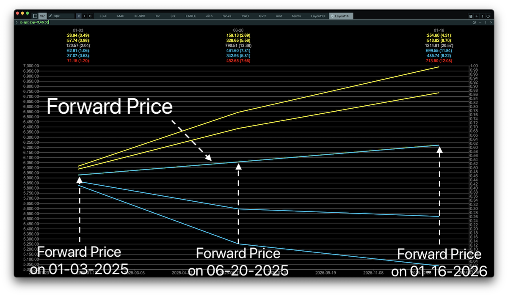

# The IP Module

IP stands for "Implied Probability". The IP module uses option prices to find the ranges where the underlying is expected to close on a given expiration within a 50% and 70% range.

Here is how it works:

## The Theory

If you think about what the price of an option should be, you quickly find yourself thinking about probabilities.

For example - if $AAPL stock price is 100, what should the price of an $AAPL Strike 110 Call expiring in 10 days be?

If stock price is below 110 at expiration the Call option will be worthless, and if stock price is above 110 it will be worth something. Thus - whatever the price of the option is, it must be deeply tied to the probability of the stock price being above or below 110.

Fischer Black, Myron Scholes, Robert Merton - standing on the shoulders of giants - fully formalized this relationship in the beautiful Black-Scholes option pricing formula. It incorporates information about what the probability is of the stock price moving in any given way.

The piece of the formula which contains this information is delta.

You might have learned that delta is the derivative of option price with respect to stock price movement - i.e it tells us how the option price will move when stock price moves. Well, it isn't just that.

It also tells us what the probability is of the stock price ending up being worth something - i.e ending up above the strike price in the case of calls, or below strike price in the case of puts, by expiration.

You'll notice this if you pull up an any option chain. You'll notice that options that are at-the-money have a delta of 0.5. Why? Because an at-the-money option has a 50/50 chance of expiring in-the-money and being worth something. If AAPL is at 100, an option with strike 100 will have a delta of 0.5 because at any point in time AAPL can go either up or down and render that option worthless. This is related to the concept of the *random-walk* which we won't explore further but the idea is that at any point in time stock price can go up or down a notch with an equal probability.

You'll also notice that deep in-the-money options have a delta close to 1. For example a call strike 10 for AAPL will have a delta of 0.9, telling us it has a 90% chance of expiring in-the-money - it is almost certain that option will be worth something.

Similarly, far out-of-the-money options have a very low delta. For example a call strike 500 for AAPL might have a delta of 0.05, telling us there is only a 5% chance that the option will be worth something because it is highly unlikely AAPL goes all the way up to 500.

There are of course many other ingredients here that I am not mentioning - such as stock price volatility, expectations, time to expiration, forward price, and others - but the point is that by looking at the delta of options you can gain information about what probability the market is assigning to the option having a positive payoff at expiration, therefore - what probability the market is assigning to the stock price moving to a given level.

## The Practice

Now that we know about the information contained in the delta of options we can explore the option chain to construct probability ranges. This is exactly what the `ip` module does. So let's break it down.

### The Forward Price

Above I mentioned how the delta of the at-the-money option is 0.5 because it has a 50% chance of expiring in-the-money. This refers to the *next instant*.

That is - if AAPL stock price is at 100 and we have a call option strike 100 expiring in the *next instant* - it will have a delta of 0.5 because there is a 50% chance the stock moves up in the *next instant* to give the option a positive payoff.

What we did there is look at the current price, then look at the expiration date, and then look at the instant before expiration.

For short time frames (days) the current price and the current price an instant before expiration is usually the same.

But for longer time frames (months/years) the current price but at at instant before expiration is different.

This is due to cost-of-carry, time value of money, and other factors we aren't getting into right now.

So, if AAPL is at 100 now and we want to analyze what the at-the-money strike is for an expiration 1 year from now we have to look at what AAPL price should be a year from now given it is 100 right now. This is the **forward price**.

We can also work backwards. We can look at the option chain - find the strikes where delta is 0.5, and those are the strikes that correspond to the forward price.

This is one of the elements of the `ip` module: it displays the forward price for each expiration:

### Probability Ranges

Next up are probability ranges. Know that the option delta tells us the probability that the option will expire in-the-money.

We can look at any option chain and find the call with a delta of 0.25. A delta of 0.25 means the option price implies a 25% chance of stock closing above that strike. We then look at the put with a delta of -0.25 - which also implies a 25% chance of the stock closing below that strike.

We combine those two strikes and we have the **50% range** - the range of prices where stock price is expected to close within with a 50% probability.

We can do this for any probability ranges you like!

We have chosen to display the **50% range** and the **70% range**.

These ranges are denoted by the two cones which are drawn with a blue line on the bottom (to denote that the level has been derived from put prices) and a yellow line on top (to denote that the level has been derived from call prices).

### Labels

Finally, the labels on top. Each expiration has a corresponding set of labels on top. The expiration date is on top, and 6 numbers are below.

The numbers (except the red number) correspond to probability ranges. Each row has two numbers - the first is the nominal size of the range, the second is the percent size of the range.

The grey number is the 50% range. The yellow and blue numbers are both the ranges on the call and put side - respectively.

This allows you to compare whether a given 50% or 70% range is priced more towards the call side vs the put side.

### Expected Move

The last number - the red one - is the **straddle** price. Again, the number on the left is the nominal straddle price and the number in parenthesis is the percentage straddle price.

This is a popular measure to understand the expected move for a stock.

footer
